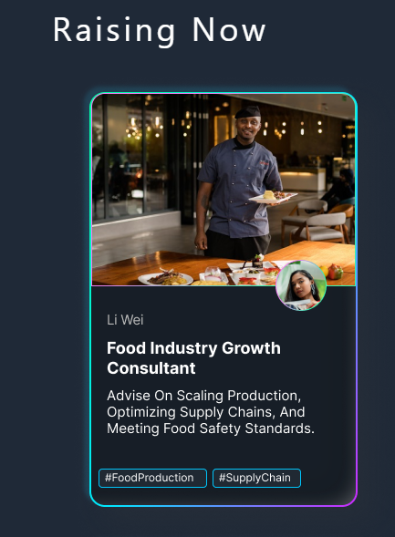
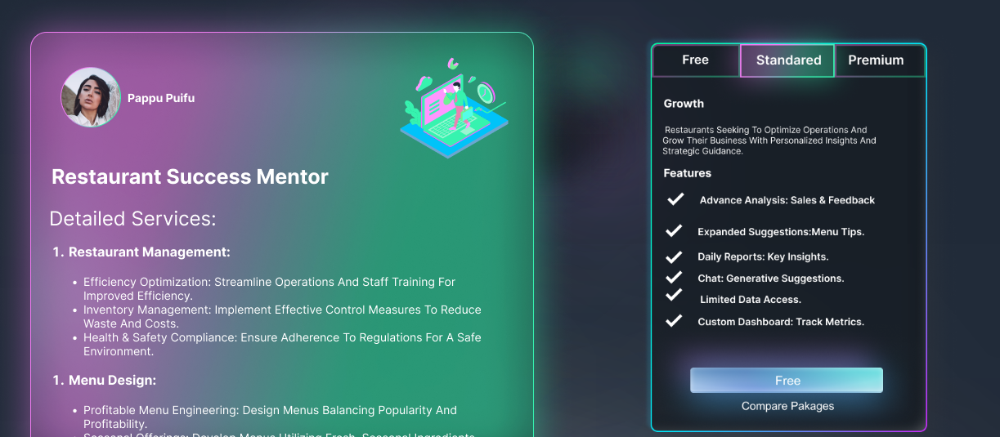

Technologies
Front-end
HTML
Tailwind CSS
Back-end
Node JS
Express JS
Mongoose
Programming Language
JavaScript

Api
OpenAI Api

NodeJS
https://nodejs.org/en

Download LTS version of node.js
- install the package

- Frontend
- npm install 
- npm install --force
- npm run dev

backend
npm install
npm install nodemon
npm run dev

This template provides a minimal setup to get React working in Vite with HMR and some ESLint rules.

Currently, two official plugins are available:

- [@vitejs/plugin-react](https://github.com/vitejs/vite-plugin-react/blob/main/packages/plugin-react/README.md) uses [Babel](https://babeljs.io/) for Fast Refresh
- [@vitejs/plugin-react-swc](https://github.com/vitejs/vite-plugin-react-swc) uses [SWC](https://swc.rs/) for Fast Refresh

Generative AI with AutoML
 
Create a GCP Project
Prepare Training Data
Train the Model
Evaluate and Fine-Tune the Model
Deploy the Model
Integration with Node.js Application via API endpoint
Data used for training
 
Sales data
Feedback Data
You can Ask relaven improvements from these datasets.

Prompt used for trainiing the AI

[
  {
    "prompt": "Can you give me an overview of our sales performance for the past month?",
    "response": "Sure! In the past month, our sales have increased by 10% compared to the previous month. We saw a significant increase in lunch sales, particularly on Fridays. However, dinner sales remained relatively stable."
  },
  {
    "prompt": "What is the average customer rating for our restaurant this month?",
    "response": "Our average customer rating for this month is 4.6 out of 5 stars. We received positive feedback for our new menu items, but some customers mentioned long wait times during peak hours."
  },
  {
    "prompt": "Can you suggest new dishes we should add to our menu based on recent trends?",
    "response": "Based on recent trends, I suggest adding more plant-based options to our menu, such as vegan burgers and salads. These items are becoming increasingly popular among our customers."
  },
  {
    "prompt": "How can we optimize staff schedules to reduce waiting times during peak hours?",
    "response": "To reduce waiting times during peak hours, we can analyze historical data to identify the busiest times and adjust staff schedules accordingly. We can also cross-train employees to handle multiple roles and tasks efficiently."
  },
  {
    "prompt": "What promotional activities would you suggest to increase overall foot traffic?",
    "response": "To increase foot traffic, we can offer limited-time promotions such as happy hour specials, buy-one-get-one-free deals, or discounts for customers who check in on social media platforms like Facebook or Instagram."
  }
]

